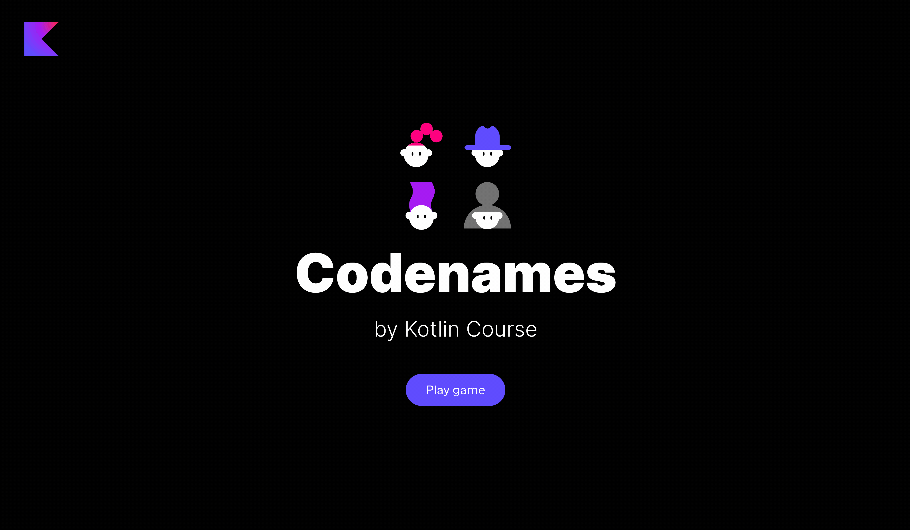
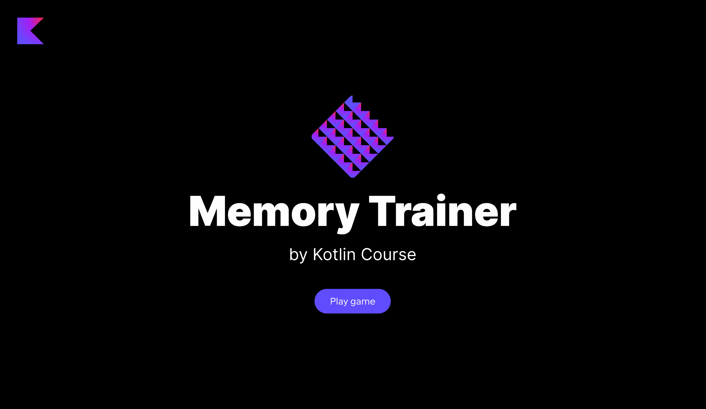

[](https://confluence.jetbrains.com/display/ALL/JetBrains+on+GitHub)
[](https://github.com/jetbrains-academy/kotlin-onboarding-part2/actions/workflows/gradle-build.yml)
[](https://github.com/jetbrains-academy/kotlin-onboarding-part2/actions/workflows/gradle-build-with-detekt.yml)
[](https://opensource.org/licenses/MIT)

# Kotlin Onboarding: Object-oriented programming

This course is designed for novices in Kotlin and focuses on the object-oriented (OOP) concepts of the Kotlin language. 
This is the second module of the course, the first module can be found on JetBrains [Marketplace](https://plugins.jetbrains.com/plugin/21067-kotlin-onboarding--introduction).
This module assumes that you are already familiar with all the constructs discussed in the first part.

Each lesson of the course is built in the form of a web project: step by step, by completing different small tasks, 
you will get a functional project in the end. At the end of each lesson, an additional similar project 
will be offered: it includes all the topics of the lesson but does not contain the theory part.

Note, this course does not provide a detailed explanation of the OOP concepts, 
it just shows how to use them in Kotlin and can briefly remind you the definitions.

All topics will be accompanied by links to [the official Kotlin documentation](https://kotlinlang.org/docs/home.html), which you can read later.

Topics covered:

- packages;
- classes, properties, and member functions;
- type aliases;
- value and data classes;
- companion objects;
- extension functions;
- objects;
- initializer blocks;
- enum classes;
- functional interfaces (Single Abstract Method, SAM);
- interfaces and inheritance;
- some built-in functions to handle errors and work with collections.

After this course, you will be ready to write basic Kotlin applications.

## Technical requirements

Before starting this course, check the following requirements.

1. Your computer needs to have a stable internet connection.
2. Git version control system needs to be installed on your computer (link to the git site: https://git-scm.com/).
3. Make sure that the path to the root folder of the course does not contain spaces, special characters, or non-Latin characters.
4. Make sure that you use the [Intellij IDEA](https://www.jetbrains.com/idea/download/?_ga=2.189310830.494255415.1682514714-1823138827.1669894241&_gac=1.83806948.1682684894.Cj0KCQjw3a2iBhCFARIsAD4jQB3QkDU43KtbIx2HzEz02KvcN7Ma3QGzkIbyX4KS3H4x8b2bl9p4EfYaAvWsEALw_wcB&_gl=1*1h13lr8*_ga*MTgyMzEzODgyNy4xNjY5ODk0MjQx*_ga_9J976DJZ68*MTY4MjY5NDIyMy4xMjUuMS4xNjgyNjk0MjM4LjQ1LjAuMA..#section=windows) with version at least `2023.1.1`.
5. Make sure that you use the [EduTools](https://plugins.jetbrains.com/plugin/10081-edutools) plugin with version at least `2023.1`.
6. To be able to run web applications, you need to have a web browser. We recommend using [Google Chrome](https://www.google.com/chrome/). 

The course is integrated into the [Intellij Idea IDE](https://www.jetbrains.com/idea/), which has a free Community license. 
You can use this license to complete the course. 
If you have some troubles with the course installation, feel free to contact us by email at education@jetbrains.com.

## Course projects

This module is dedicated to the creation of popular board games. During this module, you will develop four games:

1) **Alias**. The goal of this game is to recreate the well-known Alias game, where a card with words is generated for one player and other players need to guess these words.

<details>
<summary>Game example</summary>


</details>

2) **Word generator**. The goal of this game is to generate a card with a long word, and 
the task for the teams is to come up with as many words as possible using the letters of the original one (not necessarily all of them).

<details>
<summary>Game example</summary>


</details>

3) **Codenames**. The purpose of this project is to implement the popular board game Codenames. 
In this game, the players are split into two teams. 
Each team chooses a leader and tries to guess all the words of its team color in fewer attempts than the other team.

<details>
<summary>Game example</summary>


</details>

4) **Memory trainer**. This application will allow you to train your memory and memorize countries and their capitals.

<details>
<summary>Game example</summary>


</details>

## Getting started

**TODO: add course link**
This course is available on JetBrains Marketplace and can be installed from the 
[IntelliJ IDEA](https://www.jetbrains.com/idea/) IDE directly, but you can also use it in 
the Course Creator mode or create a course archive from the source code.

### Getting started: create a course preview from the source code

You can create a [course preview](https://plugins.jetbrains.com/plugin/10081-edutools/docs/educator-start-guide.html#preview_course) from the source code:
1. Clone the repository: 
```text
git clone https://github.com/jetbrains-academy/kotlin-onboarding-part2.git
```

2. Install [npm](https://www.npmjs.com/) and [yarn](https://yarnpkg.com/) on your computer.

3. Run yarn install in each module with frontend.

4. Build the project:
```text
./gradlew build
```

3. Install the [EduTools](https://plugins.jetbrains.com/plugin/10081-edutools/docs/educational-products.html) plugin from JetBrains Marketplace.

4. Create a new [course preview](https://plugins.jetbrains.com/plugin/10081-edutools/docs/educator-start-guide.html#preview_course).

### Getting started: create a course archive

You can create a [course archive](https://plugins.jetbrains.com/plugin/10081-edutools/docs/educator-start-guide.html#fe7010f2) from the source code:
1. Clone the repository:
```text
git clone https://github.com/jetbrains-academy/kotlin-onboarding-part2.git
```

2. Build the project:
```text
./gradlew build
```

3. Install the [EduTools](https://plugins.jetbrains.com/plugin/10081-edutools/docs/educational-products.html) plugin from JetBrains Marketplace.

4. Create a new [course archive](https://plugins.jetbrains.com/plugin/10081-edutools/docs/educator-start-guide.html#fe7010f2).

## Run tests

To run tests locally, you just need to build the project and run the following command:

```text
./gradlew test
```

The tests use the Java Reflection API under the hood to check the user's tasks.

## Want to know more?

If you have questions about the course or the tasks or if you find some errors,
you can ask questions and participate in discussions in repository [issues](https://github.com/jetbrains-academy/kotlin-onboarding-part2/issues).

## Contribution

Please be sure to review the [project's contributing guidelines](./contributing.md) to learn how to help the project.
